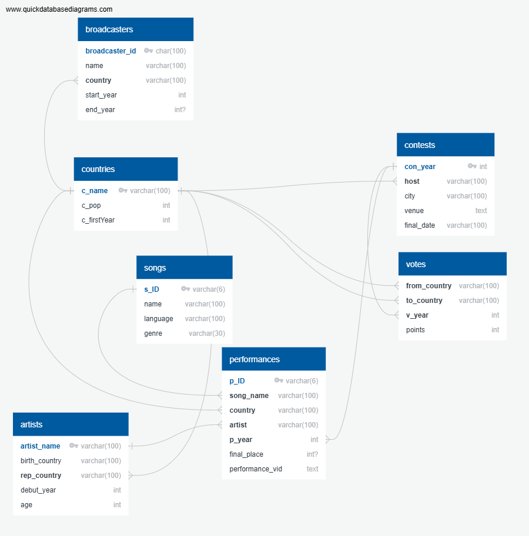

# esc_database
Database using CSV files from
- https://github.com/Spijkervet/eurovision-dataset/releases
- https://eurosong-contest.fandom.com/wiki/Eurovision_National_Broadcasters
- and wikidata, using sparql parsing (https://w.wiki/EwBR) or https://query.wikidata.org/

database hosted on mySQL, modified using Navicat Premium Lite (#broke)

